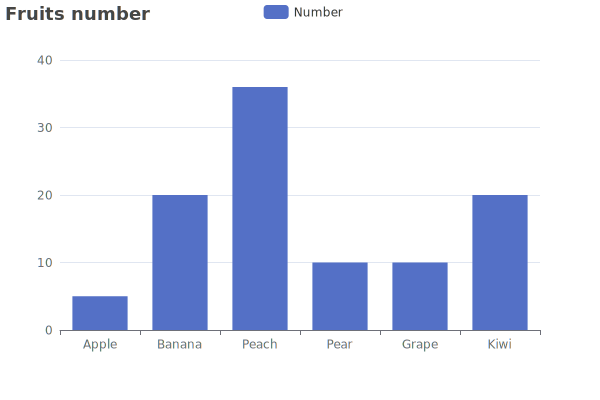
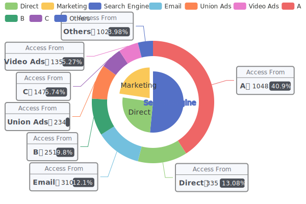

# gitbook-plugin-echarts

[](https://github.com/vowstar/gitbook-plugin-echarts/actions)
[](https://coveralls.io/github/vowstar/gitbook-plugin-echarts?branch=master)
[](https://www.npmjs.org/package/gitbook-plugin-echarts)
[](https://www.npmjs.org/package/gitbook-plugin-echarts)

[echarts](http://echarts.baidu.com/) plugin for [Honkit](https://github.com/honkit/honkit) ~~and [GitBook](https://github.com/GitbookIO/gitbook)~~.

## Installation

```bash
npm install gitbook-plugin-echarts
```

Add this plugin into ``book.json``.

```json
{
  "plugins": ["echarts"]
}
```

## Features

* Support HTML, PDF, EPUB output(make sure your gitbook support SVG)
* Support ```chart code block quote
* Multi code style support

### Beautiful Chat




## Configuration

book.json add the echarts options

```json
"pluginsConfig": {
  "chart": {

  }
}
```

## Usage


To include a echarts diagram, just wrap your definition in a "chart" code block. For example:

<pre lang="no-highlight"><code>```chart
{
    "title": {
        "text": "Fruits number"
    },
    "tooltip": {},
    "legend": {
        "data":["Number"]
    },
    "xAxis": {
        "data": ["Apple","Banana","Peach","Pear","Grape","Kiwi"]
    },
    "yAxis": {},
    "series": [{
        "name": "Number",
        "type": "bar",
        "data": [5, 20, 36, 10, 10, 20]
    }]
}
```
</code></pre>

Also you can put in your book block as

```bash

{
    "title": {
        "text": "Fruits number"
    },
    "tooltip": {},
    "legend": {
        "data":["Number"]
    },
    "xAxis": {
        "data": ["Apple","Banana","Peach","Pear","Grape","Kiwi"]
    },
    "yAxis": {},
    "series": [{
        "name": "Number",
        "type": "bar",
        "data": [5, 20, 36, 10, 10, 20]
    }]
}

```

### Extend the width

Code mode:

<pre lang="no-highlight"><code>```chart
{
    "width": "900px",
    "height": "500px",
    "title": {
        "text": "Fruits number"
    },
    "tooltip": {},
    "legend": {
        "data":["Number"]
    },
    "xAxis": {
        "data": ["Apple","Banana","Peach","Pear","Grape","Kiwi"]
    },
    "yAxis": {},
    "series": [{
        "name": "Number",
        "type": "bar",
        "data": [5, 20, 36, 10, 10, 20]
    }]
}
```
</code></pre>

Template mode:

```bash

```

> If use both configure method, the code configure will overwrite the template configure.

## Learn echarts

[echarts](https://echarts.apache.org)

## Thanks

* [midnightSuyama/gitbook-plugin-flowchart](https://github.com/midnightSuyama/gitbook-plugin-flowchart).
* [midnightSuyama/gitbook-plugin-sequence-diagrams](https://github.com/midnightSuyama/gitbook-plugin-sequence-diagrams).
* [massanek/gitbook-plugin-js-sequence-diagram](https://github.com/gmassanek/gitbook-plugin-js-sequence-diagram).
* [nsdont/gitbook-plugin-new-flowchart](https://github.com/nsdont/gitbook-plugin-new-flowchart).
* [lyhcode/gitbook-plugin-plantuml](https://github.com/lyhcode/gitbook-plugin-plantuml).

## See also

These plugins are also available on honkit.

|                                    Plugin                                     |                      Description                       |
| ----------------------------------------------------------------------------- | ------------------------------------------------------ |
| [gitbook-plugin-uml](https://github.com/vowstar/gitbook-plugin-uml)           | A plug-in that use plantuml to draw beautiful pictures |
| [gitbook-plugin-wavedrom](https://github.com/vowstar/gitbook-plugin-wavedrom) | A plug-in that can draw waveforms and register tables  |
| [gitbook-plugin-sequence](https://github.com/vowstar/gitbook-plugin-sequence) | A plug-in that can draw sequence diagrams              |
| [gitbook-plugin-flow](https://github.com/vowstar/gitbook-plugin-flow)         | A plug-in that can draw flowchart.js diagrams          |
| [gitbook-plugin-echarts](https://github.com/vowstar/gitbook-plugin-echarts)   | A plug-in that can draw various charts such as bar/pie |
