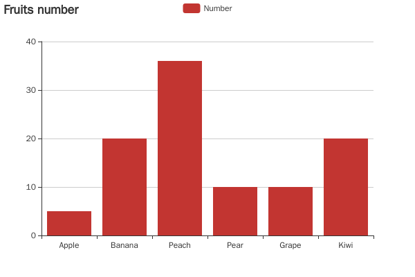

# gitbook-plugin-echarts

[](https://nodei.co/npm/gitbook-plugin-echarts/)

[echarts](http://echarts.baidu.com/) plugin for [GitBook](https://github.com/GitbookIO/gitbook)

## Installation

    $ npm install gitbook-plugin-echarts

book.json add the plugin

```
{
  "plugins": ["echarts"]
}
```

## Features

* Support HTML, PDF, EPUB output(make sure your gitbook support SVG)
* Support ```flow code block quote
* Multi code style support

### Beautiful Chat



## Configuration

book.json add the echarts options

```
"pluginsConfig": {
  "chart": {

  }
}
```

## Usage


To include a echarts diagram, just wrap your definition in a "chart" code block. For example:

<pre lang="no-highlight"><code>```chart
{
    "title": {
        "text": "Fruits number"
    },
    "tooltip": {},
    "legend": {
        "data":["Number"]
    },
    "xAxis": {
        "data": ["Apple","Banana","Peach","Pear","Grape","Kiwi"]
    },
    "yAxis": {},
    "series": [{
        "name": "Number",
        "type": "bar",
        "data": [5, 20, 36, 10, 10, 20]
    }]
}
```
</code></pre>

Also you can put in your book block as

```

{
    "title": {
        "text": "Fruits number"
    },
    "tooltip": {},
    "legend": {
        "data":["Number"]
    },
    "xAxis": {
        "data": ["Apple","Banana","Peach","Pear","Grape","Kiwi"]
    },
    "yAxis": {},
    "series": [{
        "name": "Number",
        "type": "bar",
        "data": [5, 20, 36, 10, 10, 20]
    }]
}

```

### Extend the width

Code mode:

<pre lang="no-highlight"><code>```chart
{
    "width": "900px",
    "height": "500px",
    "title": {
        "text": "Fruits number"
    },
    "tooltip": {},
    "legend": {
        "data":["Number"]
    },
    "xAxis": {
        "data": ["Apple","Banana","Peach","Pear","Grape","Kiwi"]
    },
    "yAxis": {},
    "series": [{
        "name": "Number",
        "type": "bar",
        "data": [5, 20, 36, 10, 10, 20]
    }]
}
```
</code></pre>

Template mode:

```

```

> If use both configure method, the code configure will overwrite the template configure.

### Learn EChart and more information

[echarts](http://echarts.baidu.com/) 

### This project learn from:

* [midnightSuyama/gitbook-plugin-flowchart](https://github.com/midnightSuyama/gitbook-plugin-flowchart).
* [midnightSuyama/gitbook-plugin-sequence-diagrams](https://github.com/midnightSuyama/gitbook-plugin-sequence-diagrams).
* [massanek/gitbook-plugin-js-sequence-diagram](https://github.com/gmassanek/gitbook-plugin-js-sequence-diagram).
* [nsdont/gitbook-plugin-new-flowchart](https://github.com/nsdont/gitbook-plugin-new-flowchart).
* [lyhcode/gitbook-plugin-plantuml](https://github.com/lyhcode/gitbook-plugin-plantuml).
